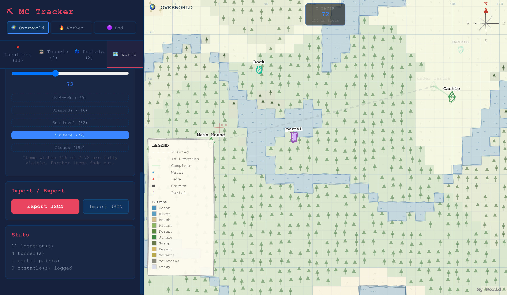
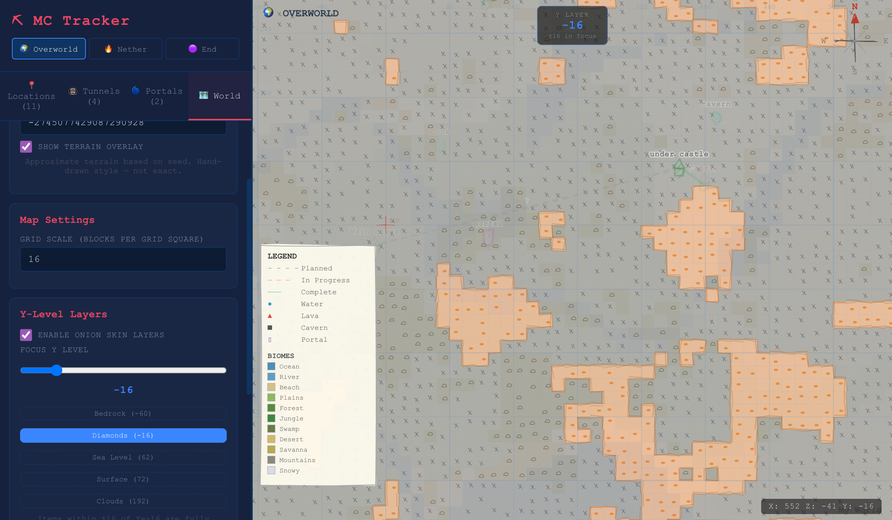
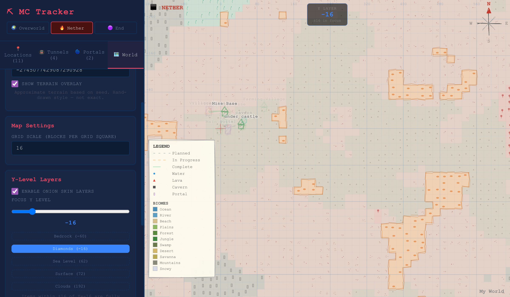
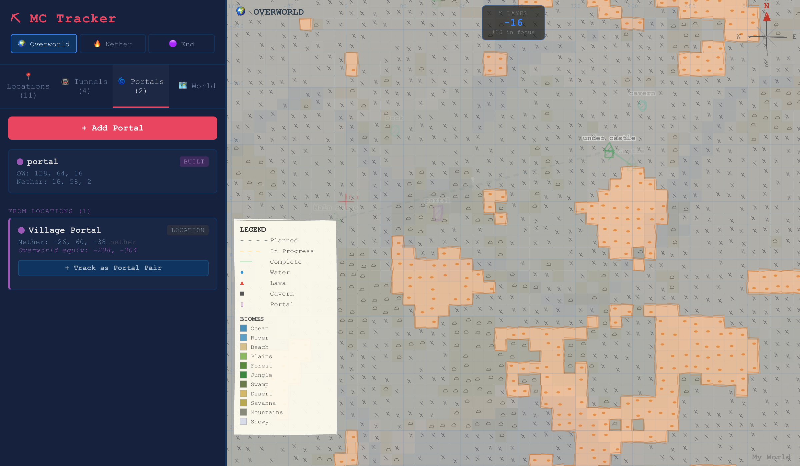

# Minecraft Fantasy Map

A hand-drawn fantasy-style map tracker for Minecraft worlds. Track your bases, plan tunnel routes, manage portal pairs, and visualize terrain — all rendered in a sketchy, parchment-like aesthetic inspired by fantasy novel maps.

**[Live Demo](https://jazzmind.github.io/minecraft-fantasy-map/)**



## Features

### Hand-Drawn Map
- Rough.js-powered sketchy rendering on HTML Canvas
- Parchment-style grid, compass rose, and legend
- Pan, zoom, and click-to-select interaction

### Accurate Biome Generation
- Enter your world seed to see biomes rendered on the map
- Uses a TypeScript port of [cubiomes](https://github.com/Cubitect/cubiomes) for accurate Overworld biome placement
- Supports Java & Bedrock seeds (biome parity for 1.18+)
- Approximate terrain for Nether and End dimensions

### Location & Tunnel Tracking
- Mark bases, villages, custom points, and portals with coordinates
- Plan and track tunnel connections between locations (planned / in progress / complete)
- Log obstacles encountered during tunneling (water, lava, caverns)

### Portal Planning
- Track Overworld ↔ Nether portal pairs
- Calculates ideal Nether coordinates (8:1 ratio)
- Warns about linking offset issues
- Portals added as locations auto-sync to the portal planner

### Y-Level Layers
- Onion-skin visualization at any Y level (-64 to 320)
- Underground view shows approximate caverns, aquifers, and lava lakes
- Quick-jump buttons for Bedrock, Diamonds, Sea Level, Surface, and Clouds
- Items fade based on Y-distance from the focus level



### Dimension Switching
- Overworld, Nether, and End views
- Nether coordinates auto-convert at 8:1 ratio
- Each dimension has its own terrain style



### Portal Management



### Data Management
- All data stored locally in your browser (localStorage)
- JSON import/export for backup and sharing
- No account or server required

## Getting Started

### Use Online

Visit the **[live demo](https://jazzmind.github.io/minecraft-fantasy-map/)** — no installation needed.

### Run Locally

```bash
git clone https://github.com/jazzmind/minecraft-fantasy-map.git
cd minecraft-fantasy-map
npm install
npm run dev
```

Open [http://localhost:5173](http://localhost:5173) in your browser.

## Tech Stack

- **React 19** + TypeScript
- **Vite** for dev server and builds
- **Rough.js** for hand-drawn canvas rendering
- **cubiomes port** for accurate Minecraft biome generation
- **localStorage** for persistence (no backend)

## How It Works

### Biome Generation

The biome engine is a TypeScript port of the C library [cubiomes](https://github.com/Cubitect/cubiomes). It implements Minecraft's actual terrain generation algorithm:

1. **Xoroshiro128++ PRNG** initialized from the world seed
2. **Double Perlin noise** for six climate parameters (temperature, humidity, continentalness, erosion, peaks & valleys, weirdness)
3. **Biome tree lookup** mapping climate values to specific biome IDs
4. **Category mapping** to group ~60 biome IDs into visual categories for the map

This produces biome placements that match the real game for any seed (Java/Bedrock 1.18+).

### Underground Features

When viewing below sea level, the map uses noise functions to approximate:
- **Caverns** — cheese-cave and spaghetti-cave style openings
- **Aquifers** — underground water pools (Y -10 to 50)
- **Lava lakes** — concentrated below Y 0, dominant below Y -48

These are approximations for planning purposes, not block-accurate representations.

## License

MIT
